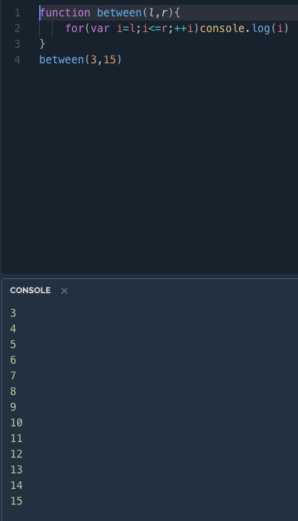

## 1.請寫一個程式可以印出指定數量的 * 號

### 程式碼

```
function star(n) {
  for (var i=0; i<n; i++)
    console.log('*')
}

star(5)
```
### 執行結果：
 

<hr/>

## 2.請寫一個函數可以印出 a..b 之間的所有整數

### 程式碼

```
function between(l,r){
    for(var i=l;i<=r;++i)console.log(i)
}
between(3,15)
```
### 執行結果：
 

<hr/>

## 3.請寫一個函數可以印出 a..b 之間的所有整數

### 程式碼

```
function isPrime(x) {
    if (x < 2) 
        return 0;
    for (var k=2; k * k <= x; k++)
        if (x % k == 0) 
            return 0;
    return 1;
}

function primeBetween(a, b) {
    for (var i=a; i<=b; i++)
        if (isPrime(i))
        console.log(i);
}

primeBetween(2, 20)
```
### 執行結果：
 